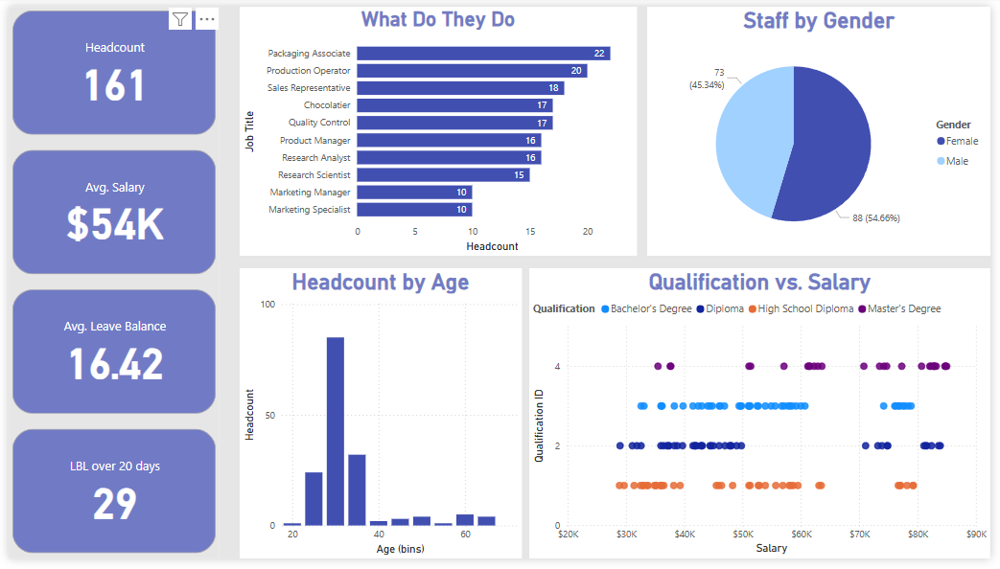

# Power BI HR Dashboard
This project leverages Power Query and Power BI to analyze real-world HR data, delivering insights through dynamic visualizations and interactive dashboards.

## Project Overview

The goal of this project is to create a comprehensive HR analytics dashboard that answers key questions regarding employee demographics, job roles, salaries, and overall workforce trends. This dashboard provides decision-makers with an intuitive and insightful tool for understanding various HR metrics.

## Key Questions Addressed

1. **How many people are in each job?** Understand the distribution of employees across different job roles.

2. **Gender break-down of the staff.** Analyze the gender diversity within the organization.

3. **Age spread of the staff.** Visualize the age distribution of employees.

4. **Which jobs pay more?** Identify the highest-paying job roles.

5. **Top earners in each job.** Highlight the top earners within each job category.

6. **Qualification vs. Salary.** Explore the relationship between employee qualifications and their salaries.

7. **Staff growth trend over time.** Track employee growth over time to understand hiring trends.

8. **Employee filter by starting letter.** Implement a quick filter to find employees by the first letter of their name.

9. **Leave balance analysis.** Analyze leave balances across the organization.

10. **Quick HR Dashboard.** Provide a high-level overview of key HR metrics in a single dashboard.

## Tools Used

- **Power BI**: For building interactive dashboards and visualizations.
- **Power Query**: For data extraction, transformation, and loading (ETL).

## Insights and Impact

This project showcases the ability to handle HR data efficiently, derive actionable insights, and create dashboards that support data-driven decision-making in the HR domain.

## How to Run

1. Open the Power BI file.
2. Refresh data to ensure up-to-date insights.
3. Interact with visualizations and filters to explore different metrics.